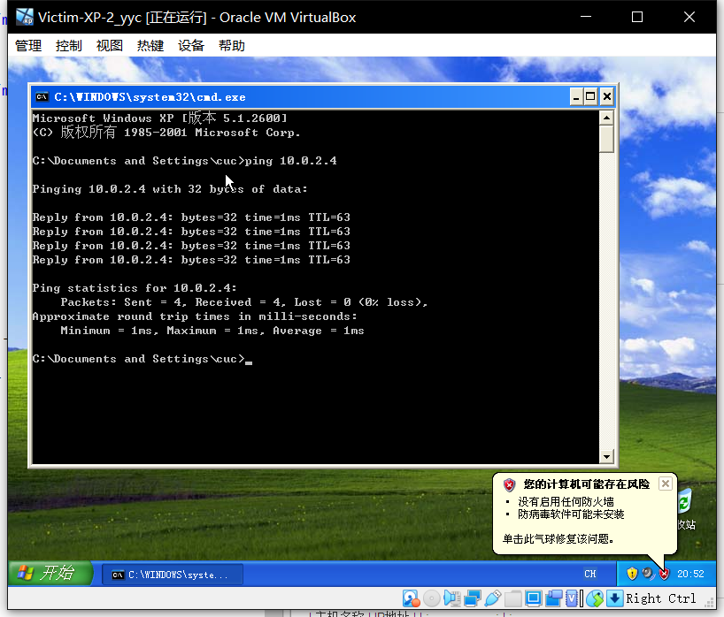

# 基于 VirtualBox 的网络攻防基础环境搭建

## 实验目的

* 掌握 VirtualBox 虚拟机的安装与使用；
* 掌握 VirtualBox 的虚拟网络类型和按需配置；
* 掌握 VirtualBox 的虚拟硬盘多重加载；

## 实验环境

以下是本次实验需要使用的网络节点说明和主要软件举例：

* VirtualBox 虚拟机
* 攻击者主机（Attacker）：Kali Rolling 2109.2
* 网关（Gateway, GW）：Debian Buster
* 靶机（Victim）：From Sqli to shell / xp-sp3 / Kali

## 实验要求

* 虚拟硬盘配置成多重加载，效果如下图所示；

* 搭建满足如下拓扑图所示的虚拟机网络拓扑；

> 根据实验宿主机的性能条件，可以适度精简靶机数量

* 完成以下网络连通性测试；
    - [x] 靶机可以直接访问攻击者主机
    - [x] 攻击者主机无法直接访问靶机
    - [x] 网关可以直接访问攻击者主机和靶机
    - [x] 靶机的所有对外上下行流量必须经过网关
    - [x] 所有节点均可以访问互联网

## 实验结果

|     主机名称      |                          IP地址                          |
| :---------------: | :------------------------------------------------------: |
| Attacker-Kali_yyc |                         10.0.2.4                         |
| debian_gateway_yyc| 10.0.2.15 & 192.168.134.3 & 172.16.111.1 & 172.16.222.1 |
| Victim-Kali-1_yyc |                      172.16.111.147                      |
| Victim-XP-1_yyc   |                      172.16.111.132                      |
| Victim-Debian-2_yyc|                      172.16.222.133                      |
| Victim-XP-2_yyc |                      172.16.222.143                      |

### Task1:靶机可以直接访问攻击者主机

### Task2:攻击者主机无法直接访问靶机

### Task3:网关可以直接访问攻击者主机和靶机

### Task4:靶机的所有对外上下行流量必须经过网关

通过`tail -F /var/log/dnsmasq.log`可以监控网关上的网络活动

可以看到从内部访问外网需要经过网关，而将网关关闭后无法访问外网，说明靶机的所有对外上下行流量必须经过网关

### Task5:所有节点均可以访问互联网

