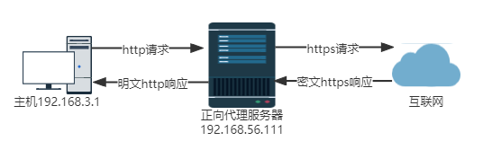
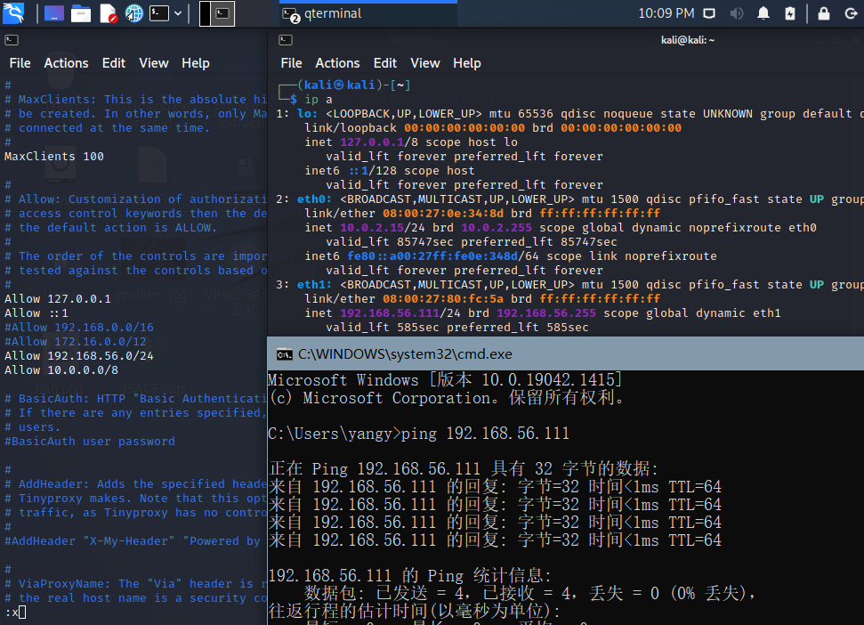
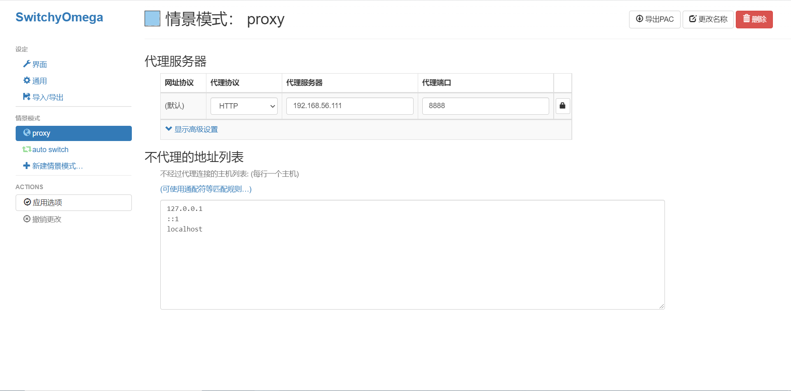
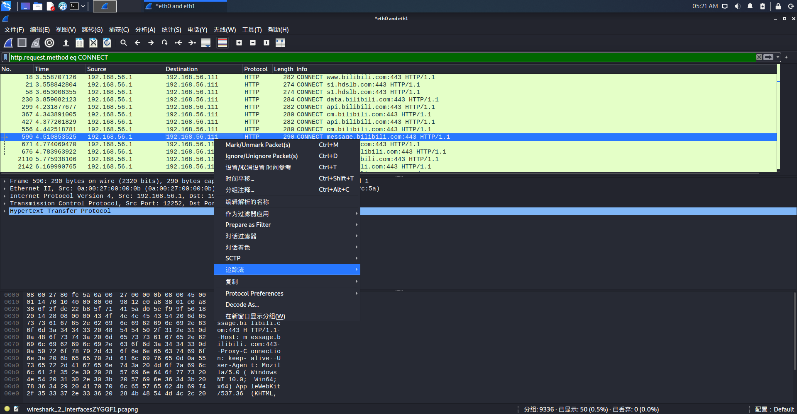
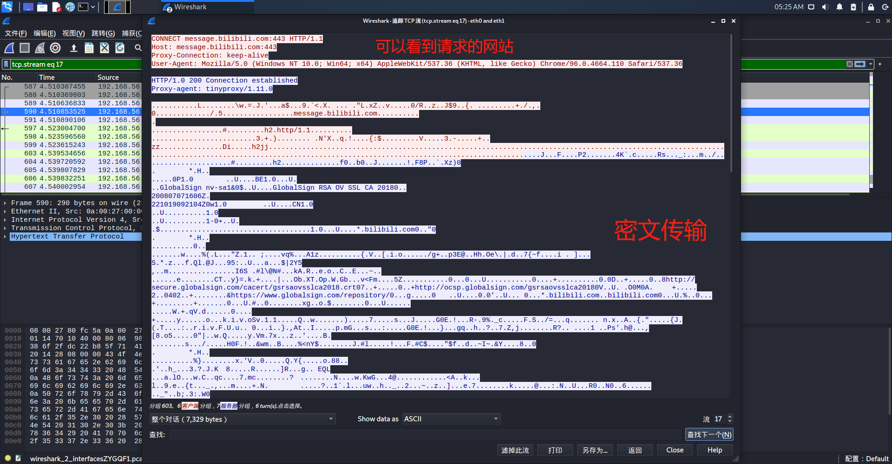
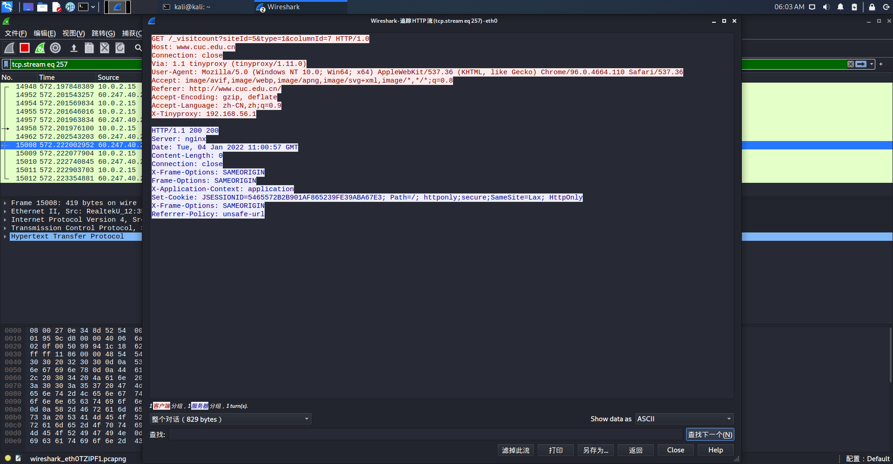
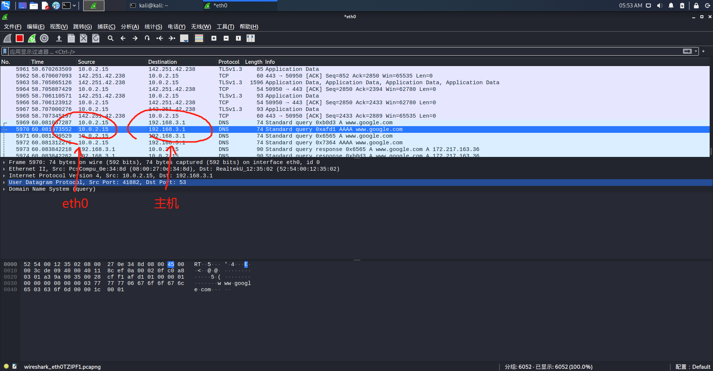

# HTTP代理服务器实验

## 实验目的

Q：使用http代理服务器访问HTTPS站点时，通信传输内容是否会被代理服务器“看到”？

A：结论是代理服务器不知道客户端和服务器的HTTPS通信内容，但代理服务器知道客户端访问了哪个HTTPS站点，这是由http代理的协议机制决定的：代理客户端会发送Connect请求到http代理服务器。

实验验证：在Kali Linux中安装tinyproxy，然后用主机设置浏览器代理指向tinyproxy建立的HTTP正向代理，在Kali中用wireshark抓包，分析抓包过程，理解HTTP正向代理HTTPS流量的特点。

## （来自老师的）提醒注意：

> HTTP代理服务器在转发客户端请求时，可能会添加Via字段，从而向目标站点暴露客户端正在使用代理访问。类似的，匿名通信应用tor的部分出口节点也会在http请求中自动加入via字段，向被访问站点宣告：当前请求正在使用匿名通信网络tor提供的匿名通信服务。

tinyproxy使用主要注意事项：

```bash
apt-get update
apt-get install tinyproxy

# 编辑tinyproxy，取消Allow 10.0.0.0/8行首注释
/etc/init.d/tinyproxy start

# 设置虚拟机联网方式为NAT和端口转发，默认tinyproxy监听8888端口
# 主机浏览器设置代理指向tinyproxy的服务地址
# 虚拟机里开启wireshark抓包
# 主机访问https站点
# 结束抓包，分析抓包结果
```

wireshark分析HTTP代理流量技巧：

* http.request.method eq CONNECT 查看所有HTTPS代理请求
* http.request.method eq GET 查看所有HTTP GET代理请求
* [使用wireshark解密HTTPS流量的方法](http://support.citrix.com/article/CTX116557) [方法2](https://wiki.wireshark.org/SSL)
* [使用wireshark提取pcap包中的SSL证书](http://mccltd.net/blog/?p=2036)
  * wireshark首选项中确认TCP协议的Allow subdissector to reassemble TCP streams选项处于启用状态
  * 通过显示筛选过滤规则（例如：tcp.port == 443），找到SSL会话
  * 通过packet list里的info列找到Certificate
      * 在packet details面板里依次展开Handshake Protocol: Certificate --> Certificates，如果有多个证书，会看到多个默认折叠起来的Certificate
      * 右键选中Certificate，在右键菜单里使用Export Selected Packet Bytes功能即可导出DER格式的SSL证书
  * 使用openssl命令行工具解析DER证书
openssl x509 -in xxx.der -inform der -text -noout

## 网络拓扑图



## 实验步骤

1. 按照提示中内容正确配置tinyproxy，其中，**编辑tinyproxy，取消Allow 10.0.0.0/8行首注释**的步骤需要通过`sudo vim /etc/tinyproxy/tinyproxy.conf`来进行修改。此外，为了能够通过host-only网卡与宿主机进行通信，还要`Allow 192.168.56.0/24`。



2. 在chrome浏览器中安装`SwitchyOmega`插件，并配置好代理服务器和端口号。



3. 在kali中用`systemctl start proxy`命令启动proxy服务，并使用wireshark在kali进行抓包，在宿主机浏览器中浏览网页，查看抓包结果。用`http.request.method eq CONNECT`查看所有HTTPS代理请求，可以顺便用右键→追踪流→TCP流来查看内容。



4. 观察结果，可以发现内容被加密了，但是能够看到请求的网址。



5. 用`http.request.method eq GET`查看所有HTTP GET代理请求，也同样追踪流并查看内容，发现其中的内容没有加密，甚至连cookie都是以明文传输。



## 实验结论

- 不要轻信代理服务器的安全性
- 代理服务器与用户之间的数据交流是明文传输，所以会涉及信息的泄露（如cookie信息）
- 在使用开放代理时必须谨慎，避免敏感数据被嗅探和避免重要数据被篡改。

## 出现的问题

对eth0（代理服务器和宿主机进行通信的网卡）抓包时，抓到的包当中不包含HTTP GET代理请求。



（未解决，最后是访问了白杨网才看到了GET请求，但是白杨网不是HTTPS协议）

（顺带一提为什么学校的官网不是HTTPS的呢）
