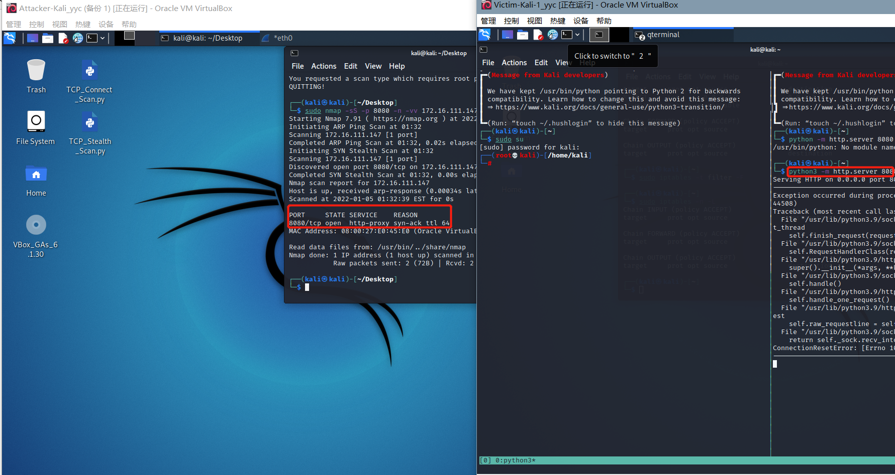
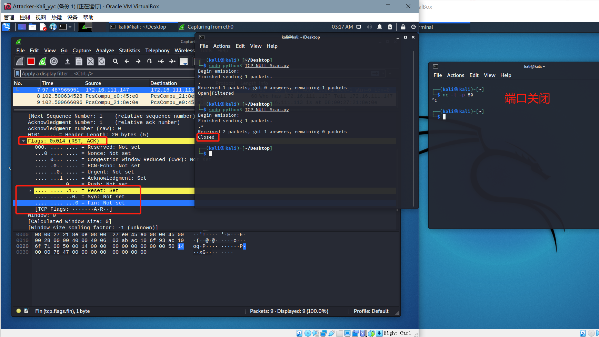

# 基于 Scapy 编写端口扫描器

## 实验目的 

* 掌握网络扫描之端口状态探测的基本原理

## 实验环境

* python + [scapy](https://scapy.net/)

## 实验要求

* 禁止探测互联网上的 IP ，严格遵守网络安全相关法律法规
* 完成以下扫描技术的编程实现

- [x] TCP connect scan / TCP stealth scan

- [x] TCP Xmas scan / TCP fin scan / TCP null scan

- [x] UDP scan

- [x] 上述每种扫描技术的实现测试均需要测试端口状态为：`开放`、`关闭` 和 `过滤` 状态时的程序执行结果

- [x] 提供每一次扫描测试的抓包结果并分析与课本中的扫描方法原理是否相符？如果不同，试分析原因；

- [x] 在实验报告中详细说明实验网络环境拓扑、被测试 IP 的端口状态是如何模拟的

- [x] （可选）复刻 `nmap` 的上述扫描技术实现的命令行参数开关

---

## 网络拓扑


## 先验知识*


1. TCP connect scan 

> 这种扫描方式可以使用 Connect()调用，使用最基本的 TCP 三次握手链接建立机制，建立一个链接到目标主机的特定端口上。首先发送一个 SYN 数据包到目标主机的特定端口上，接着我们可以通过接收包的情况对端口的状态进行判断。

三种情况下的不同响应：

- 接收 SYN/ACK 数据包，说明端口是开放状态的；
- 接收 RST/ACK 数据包，说明端口是关闭的并且链接将会被重置；
- 目标主机没有任何响应，意味着目标主机的端口处于过滤状态。

> 若接收到 SYN/ACK 数据包（即检测到端口是开启的），便发送一个 ACK 确认包到目标主机，这样便完成了三次握手连接机制。成功后再终止连接。

[TCP标志位详解（TCP Flag）](https://blog.csdn.net/ChenVast/article/details/77978367)


1. TCP SYN scan
   
> 与 TCP Connect 扫描不同，TCP SYN 扫描并不需要打开一个完整的链接。发送一个 SYN 包启动三方握手链接机制，并等待响应。

三种情况下的不同响应：

- 接收到一个 SYN/ACK 包，表示目标端口是开放的；
- 接收到一个 RST/ACK 包，表明目标端口是关闭的；
- 没有响应，说明端口是被过滤的状态。

> 当得到的是一个 SYN/ACK 包时通过发送一个 RST 包立即拆除连接。

3. TCP Xmas scan

> Xmas 发送一个 TCP 包，并对 TCP 报文头 FIN、URG 和 PUSH 标记进行设置。

- 若是关闭的端口则响应 RST 报文；
- 开放或过滤状态下的端口则无任何响应
  
> 优点是隐蔽性好，缺点是需要自己构造数据包，要求拥有超级用户或者授权用户权限。


4. TCP fin scan 
  
> 仅发送 FIN 包，它可以直接通过防火墙.

- 如果端口是关闭的就会回复一个 RST 包
- 如果端口是开放或过滤状态则对 FIN 包没有任何响应。

> 其优点是 FIN 数据包能够通过只监测 SYN 包的包过滤器，且隐蔽性高于 SYN 扫描。缺点和 SYN 扫描类似，需要自己构造数据包，要求由超级用户或者授权用户访问专门的系统调用。


5. TCP null scan

> 发送一个 TCP 数据包，关闭所有 TCP 报文头标记。

- 只有关闭的端口会发送 RST 响应。
  
> 其优点和 Xmas 一样是隐蔽性好，缺点也是需要自己构造数据包，要求拥有超级用户或者授权用户权限。


6. UDP scan

> UDP 是一个无链接的协议，当我们向目标主机的 UDP 端口发送数据,我们并不能收到一个开放端口的确认信息,或是关闭端口的错误信息。

- 如果收到一个 ICMP 不可到达的回应，那么则认为这个端口是关闭的
- 对于没有回应的端口则认为是开放的，但是如果目标主机安装有防火墙或其它可以过滤数据包的软硬件,那我们发出 UDP 数据包后,将可能得不到任何回应,我们将会见到所有的被扫描端口都是开放的。

UDP扫描比较简单，一般如果返回ICMP port unreachable说明端口是关闭的，而如果没有回应或有回应(有些UDP服务是有回应的但不常见)则认为是open，但由于UDP的不可靠性，无法判断报文段是丢了还是没有回应，**所以一般扫描器会发送多次**，然后根据结果再判断。这也是为什么UDP扫描这么慢的原因。

## 环境配置*

1. 配置端口开放状态
   
  ```
  使用以下命令开启80端口：
  nc -l -p 80
  使用以下命令查看端口开放情况：
  netstat -ntlp #查看使用tcp协议端口情况
  netstat -nulp #查看使用udp协议端口情况
  ``` 
  也可以通过使用某种服务开启端口
  ```
  比如通过开启dnsmasq服务来开启53端口
  systemctl start dnsmasq.service
  ```


2. 使用以下命令进行端口的过滤设置
  
  ```
  iptables -n -L
  # 查看本机关于IPTABLES的配置 以列表的形式显示出当前使用的 iptables 规则，并不做解析

  iptables -A INPUT -p tcp --dport 80 -j REJECT
  # -A 将规则添加到默认的 INPUT（入站）链的末尾的操作指令
  # -p 指定特定的协议
  # --dport 目的端口号

  iptables -t filter -F
  -t filter：对过滤表进行操作，用于常规的网络地址及端口过滤。
  -F：清空列表中的所有规则。
  ```

## 实验过程

1. TCP connect scan 

- [代码](scripts/TCP_Connect_Scan.py)

- 效果展示

  - 端口关闭时：
  
  

  - 端口开放时：

  

  - 端口过滤时：

  

    - 其中配置过滤状态：

    

- 结果分析：与课本中的扫描方法原理相符

- nmap复刻实验（仅截取三个当中的一个）：

    - 使用`nmap -sT -p 8080 172.16.111.147`指令

    

2. TCP stealth scan

- [代码](scripts/TCP_Stealth_Scan.py)

- 效果展示

  - 端口开放时：

  

  - 端口关闭时：
  
  

  - 端口过滤时：

  

- 结果分析：与课本中的扫描方法原理相符

- nmap复刻实验（仅截取三个当中的一个）：

    - 使用`nmap -sS -p 8080 -n -vv 172.16.111.147`指令

    

3. TCP Xmas scan

- [代码](scripts/TCP_Xmas_Scan.py)

- 效果展示

  - 端口开放时：

  

  - 端口关闭时：
  
  

  - 端口过滤时：

  

- 结果分析：与课本中的扫描方法原理相符

- nmap复刻实验（仅截取三个当中的一个）：

    - 使用`nmap -sX -p 8080 -n -vv 172.16.111.147`指令

    

4. TCP fin scan

- [代码](scripts/TCP_Fin_Scan.py)

- 效果展示

  - 端口开放时：

  

  - 端口关闭时：
  
  

  - 端口过滤时：

  

- 结果分析：与课本中的扫描方法原理相符

- nmap复刻实验（仅截取三个当中的一个）：

    - 使用`nmap -sF -p 8080 -n -vv 172.16.111.147`指令

    

5. TCP null scan

- [代码](scripts/TCP_NULL_Scan.py)

- 效果展示

  - 端口开放时：

  

  - 端口关闭时：
  
  

  - 端口过滤时：

  

- 结果分析：与课本中的扫描方法原理相符

- nmap复刻实验（仅截取三个当中的一个）：

    - 使用`nmap -sN -p 8080 -n -vv 172.16.111.147`指令

    

6. UDP scan

- [代码](scripts/UDP_Scan.py)

- 效果展示

  - 端口开放时：

  

  - 端口关闭时：
  
  

  - 端口过滤时：

  

- 结果分析：与课本中的扫描方法原理相符

- nmap复刻实验（仅截取三个当中的一个）：

    - 使用`nmap -sU -p 53 -n -vv 172.16.111.147`指令

        - 端口开启时：
    
        

        - 端口关闭时：

        

## 实验中遇到的问题与解决方法

- 端口不管是开启还是关闭状态nmap的返回值都一样

    

    - 解决方法：用python自带的http服务开启一个新的端口，使用如下命令即可。

    ```
    python3 -m http.server 8080
    ```

- 在做中间三个实验时会出现`Attribute Error`的报错

    

    - 解决方法：将代码中`"<type 'NoneType'>"`字段改为`"<class 'NoneType'>"`即可。

- 在做UDP scan实验时需要用到dns服务，但是无法使用`dnsmasq`

    

    - 解决办法1：原来不是自带的，要用`sudo apt-get install dnsmasq`安装。
    - 解决方法2：可以使用`nc -u -l -p 53 < /etc/passwd`语句，一样能开启dns服务。

## 参考资料

**标题中带"*"的内容来自[EddieXu的作业仓库](https://github.com/CUCCS/2021-ns-public-EddieXu1125/tree/chap0x05/chap0x05)**

[Port scanning using Scapy](https://resources.infosecinstitute.com/topic/port-scanning-using-scapy/)